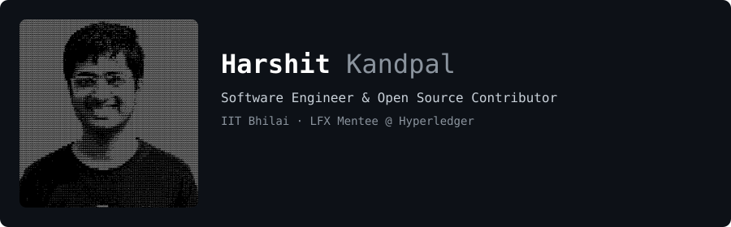

   

---

### Experience

#### LFX Mentorship Mentee — **The Linux Foundation (Hyperledger Fabric-X)** 
- engineering Fabric-X integration paths into Fablo's deployment engine.

 
 
### Tech Stack 

                   

 

### GitHub Stats

